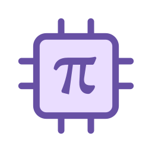
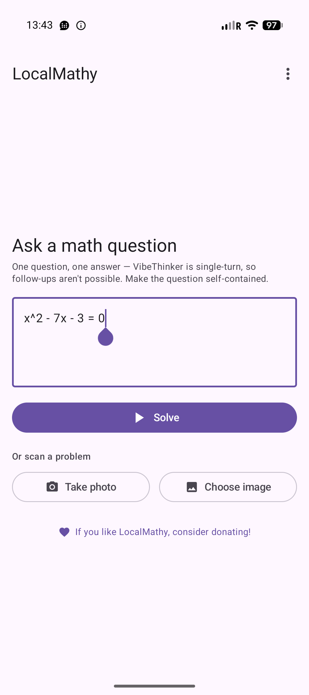
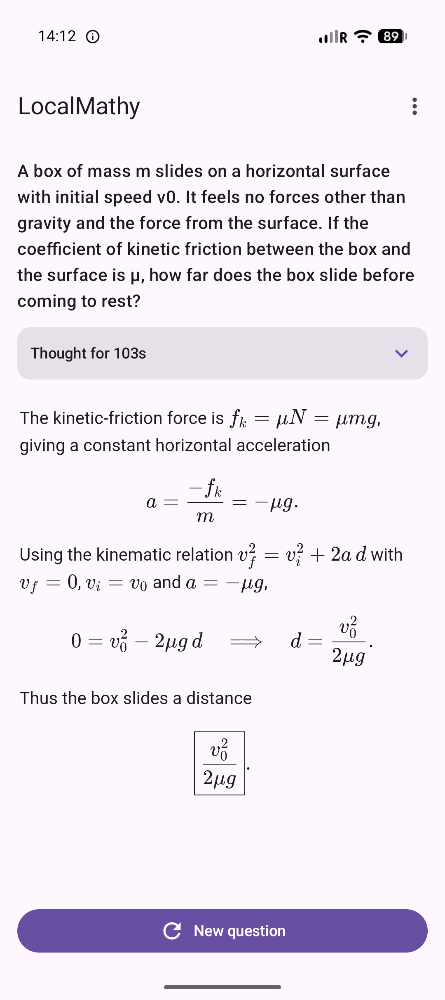
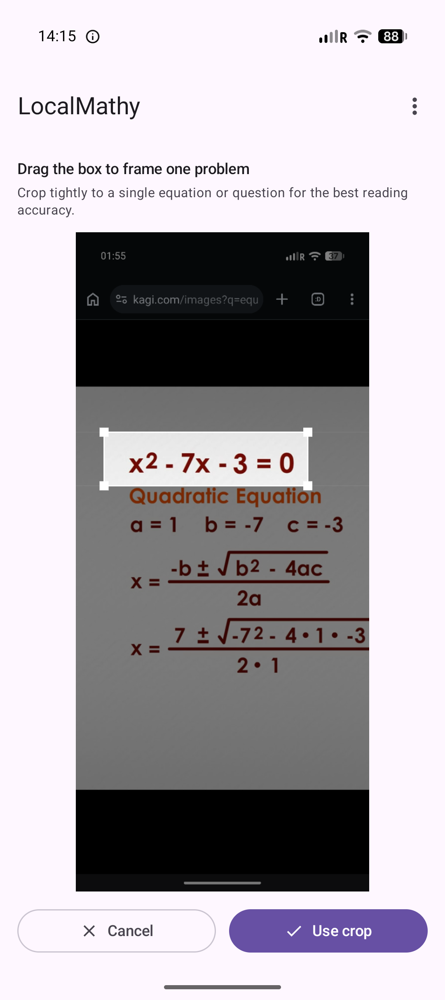

<p align="center">
  
</p>

# LocalMathy

Fully offline, on-device math solving for Android (iOS planned). LocalMathy
runs [VibeThinker-3B](https://huggingface.co/litert-community/VibeThinker-3B) on
[LiteRT.](https://ai.google.dev/edge/litert) You ask a math question (or snap a
photo of one) and it reasons through the problem and renders the answer, all
without a network connection or an account. Nothing you type or photograph ever
leaves the device.

> Note: Device needs to be realatively powerful enough to handle the 3B model, tested on my personal device, which is a Pixel 9, it works well. I also tried it on a S24 and it is blazing fast there.

## Screenshots

| Ask a question | Worked solution | Solve from a photo |
| :---: | :---: | :---: |
|  |  |  |

## Features

- **Fully offline and private:** all inference runs locally; no account, no
  cloud, no telemetry.
- **Step-by-step reasoning:** streamed into a collapsible "Thinking" pane, then a
  clean final answer.
- **Markdown + LaTeX:** answer rendering, with tap-to-copy on boxed answers.
- **Solve from a photo:** snap or pick a picture of a problem, crop it, and an
  optional on-device vision model reads it into an editable question.
- **Optional local history:** of questions and answers, stored on-device.
- **Light and dark themes**.

## Getting the model

On first launch the app offers two options for the reasoning model:

1. **Download from Hugging Face:** fetches `model.litertlm` (~1.9 GB, int4)
   straight from `litert-community/VibeThinker-3B`. The download is resumable.
2. **Import a `.litertlm` file:** if you already have the model on the device, or would like to use a diffrent model (such as VibeThinker 1.5B) pick it with the system file picker and the app copies
   it into its own storage.

The model is stored in the app's internal storage
(`files/models/VibeThinker-3B.litertlm`) since internal storage is plain ext4,
which the GPU backend needs to map the weights to not bottleneck.

Photo solving needs a separate optional vision model (Gemma 4 E2B, ~2.6 GB),
which you can download or import the first time you use the feature. Typed
questions don't need it.

## Building

```sh
./gradlew :composeApp:assembleDebug
```

Requires JDK 17+ and the Android SDK (compileSdk 35). Install the debug APK
with `./gradlew :composeApp:installDebug` or via Android Studio.

## F-Droid

Will add link soon.

## License

LocalMathy is licensed under the **GNU AGPL-3.0** see [LICENSE](LICENSE).
